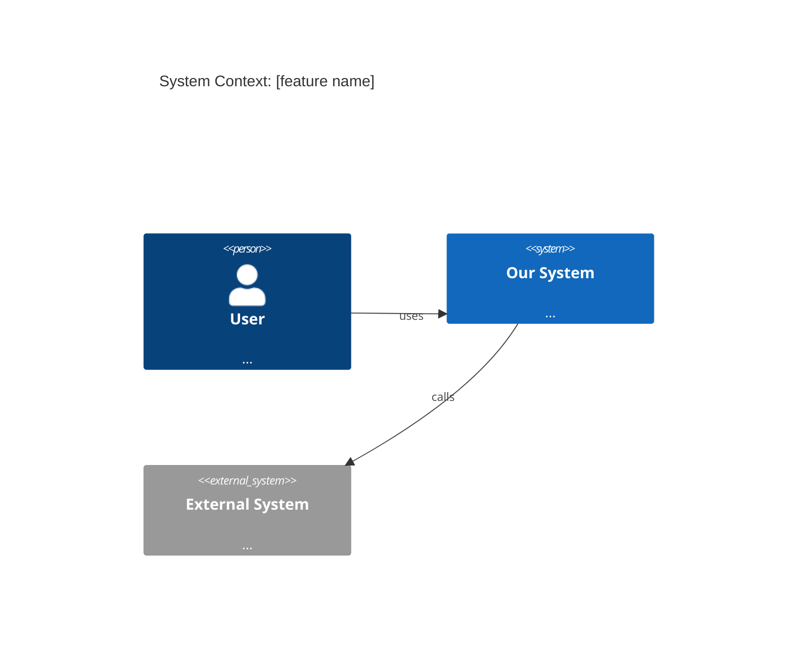

# /tech-plan

Translate a PRD into a rigorous technical design document — covering architecture, data, security, observability, cost, and milestones — then publish it to the Linear project. If the PRD leaves critical questions unanswered, produces an open-questions document instead so the programmer can align with the product manager before designing.

## When to Use

- After `/refine` has produced a scoped PRD and it is ready for technical design
- Before `/plan-ticket` — tech-plan produces the architecture; plan-ticket produces the TDD execution steps
- When the team needs to align on a solution before any code is written

## Arguments

`/tech-plan <linear-url-or-id>`

If no argument is given, ask the user to provide the Linear issue URL or ID.

> For all Linear operations follow the **Linear Access** priority order defined in `AGENTS.md`.

## Procedure

### 1. Fetch the PRD

Retrieve the Linear issue using the Linear Access method from `AGENTS.md`. Extract the full description including: Context, Jobs to Be Done, Use Cases, Root Cause, Metrics, Business Solution, and Technical Solutions sections.

### 2. Assess Clarity

Before designing anything, audit the PRD for blockers. A blocker is any gap that would force an assumption with significant architectural consequences.

Check for:

- [ ] Are the Jobs to Be Done specific enough to evaluate solution fit?
- [ ] Do the use cases cover the full user journey (not just the happy path)?
- [ ] Is the expected scale (users, requests, data volume) stated or estimable?
- [ ] Are integration points with other systems identified?
- [ ] Are there regulatory, compliance, or data-residency constraints?
- [ ] Is the expected latency / availability SLA stated or implied?
- [ ] Are there existing systems this must stay compatible with?

**If 3 or more blockers are found:** skip Steps 3–6, produce an Open Questions document (see Appendix), publish it to Linear, and ask the user to schedule a PM alignment session before returning to this skill.

**If fewer than 3 blockers:** note the open questions inline in the technical document and proceed.

### 3. Explore the Codebase

Ground the design in what already exists:

1. **Map the affected services** — identify which Rails app, Go service, or Next.js app owns the domain in question
2. **Understand the current data model** — read relevant migrations, schema files, or struct definitions
3. **Identify existing patterns** — how are similar features structured? (service objects, repositories, domain events, REST vs GraphQL, etc.)
4. **Find integration boundaries** — what external systems or internal services does this touch?
5. **Check existing observability** — what metrics, logs, and traces exist today in the affected area?
6. **Review recent related changes** — `git log --oneline -S "keyword"` to surface relevant history

### 4. Guide the Technical Design

Work through each dimension below interactively. For each one, present your analysis and ask: "Does this look right, or do you see it differently?"

Do not move to the next dimension until the user has confirmed or redirected the current one.

---

#### 4.1 Architecture Overview — C4 Model

Produce diagrams at the levels relevant to the change. Use Mermaid syntax so diagrams render inline in Linear and most markdown tools.

**Level 1 — System Context**
Show the system being changed and its relationships to users and external systems.



**Level 2 — Container**
Show the internal apps/services involved and how they communicate.

**Level 3 — Component** (only if the change is complex enough to warrant it)
Show the key components within the affected container.

For each diagram, explain: what is changing vs. what already exists.

---

#### 4.2 Data Design

- What new models, tables, or collections are needed?
- What existing models change, and how (new columns, removed columns, type changes)?
- Are there indexing requirements? Justify each index by the query it serves.
- Are there data migration implications? What is the migration strategy (online vs. offline, backfill, dual-write)?
- Are there data retention or deletion requirements (GDPR, TTL)?

---

#### 4.3 API Design

- What new endpoints, RPCs, or events are introduced?
- What is the request/response shape?
- Are there breaking changes to existing contracts? If so, what is the versioning strategy?
- Is this synchronous (HTTP/RPC) or asynchronous (queue, event)? Why?

---

#### 4.4 Key Patterns and Decisions

Identify the architectural patterns that apply and justify the choice:

- **Data access:** active record vs. repository, ORM vs. raw SQL, read model vs. write model
- **Async processing:** background jobs, event sourcing, pub/sub, webhooks
- **Caching:** what to cache, where (in-process, Redis, CDN), invalidation strategy
- **Error handling:** retry logic, dead-letter queues, circuit breakers
- **State management** (frontend): local, server state, optimistic updates

For each pattern chosen, note: what alternatives were considered and why they were rejected.

---

#### 4.5 Security

- **Authentication & authorisation:** what permissions govern this feature? Are new roles or scopes needed?
- **Input validation:** what user-controlled data enters the system, and where is it validated?
- **Data sensitivity:** does this feature touch PII, financial data, or secrets? How is it protected at rest and in transit?
- **Abuse vectors:** rate limiting, enumeration, privilege escalation, SSRF — which apply here?
- **Audit trail:** does this action need to be logged for compliance or forensics?

---

#### 4.6 Performance

- **Expected load:** estimated RPS, concurrent users, data volume at launch and at 10×
- **Bottlenecks:** where are the likely hotspots? (N+1 queries, synchronous external calls, large payloads)
- **Benchmarks needed:** which paths require a load test before shipping?
- **Degradation strategy:** what happens under load? (graceful degradation, feature flags, circuit breakers)

---

#### 4.7 Observability

For each of the three pillars, specify what must exist before this ships — not after:

- **Metrics:** what counters, gauges, and histograms are needed? Name them (e.g. `orders.checkout.duration_ms p99`). What are the alert thresholds?
- **Logs:** what events must be logged, at what level, and with what structured fields?
- **Traces:** which service boundaries need distributed trace spans?
- **Dashboards:** what does the on-call engineer look at to know this feature is healthy?

---

#### 4.8 Cost & Capacity

- **Infrastructure delta:** what new resources does this require? (compute, storage, cache, queues, external APIs)
- **Cost estimate:** rough order of magnitude at current scale and at 10×
- **Traffic shape:** is this bursty or steady? Does it require auto-scaling configuration?
- **Limits and quotas:** does any third-party integration have rate limits that constrain the design?

---

### 5. Milestone Breakdown

Break the work into logical, independently shippable milestones. Each milestone should deliver value or reduce risk on its own — not just be a technical layer.

Apply these rules:
- Infrastructure and observability ship in **Milestone 1**, before any feature code
- Data migrations are their own milestone, never bundled with feature logic
- Each milestone has a clear definition of done and can be deployed independently
- Order milestones to de-risk the unknowns earliest (spikes and proofs-of-concept come first)

Present the breakdown as:

```
### Milestone N: [name]

**Goal:** [what this delivers to the user or the system]
**Includes:**
- [work item — described in plain terms, not yet a ticket]
**Definition of done:** [specific, observable outcome]
**Dependencies:** [what must be complete before this starts]
**Risk:** [what could go wrong, and the mitigation]
```

Ask: "Does this milestone order make sense? Anything to split, merge, or resequence?"

### 6. Produce the Technical Document

Assemble all confirmed sections into the final document:

```
## Technical Design: [PRD Title]

### Status: Draft | Open Questions | Ready for Implementation

### Summary
[3-5 sentences. What are we building, why, and what approach are we taking?]

### Open Questions
[Any unresolved items from Step 2 — each with an owner and a deadline]

### Architecture
[C4 diagrams and narrative]

### Data Design
[Schema changes, migration strategy, indexing]

### API Design
[Endpoints / events / contracts]

### Key Patterns and Decisions
[Chosen patterns with rationale and alternatives considered]

### Security
[Auth, validation, sensitivity, abuse vectors, audit]

### Performance
[Load estimates, bottlenecks, benchmarks, degradation]

### Observability
[Metrics, logs, traces, dashboards — all required before ship]

### Cost & Capacity
[Infrastructure delta, cost estimate, traffic shape]

### Milestones
[Full milestone breakdown — confirmed in Step 5. Work items described in plain terms; tickets are not created here.]
```

### 7. Publish to Linear

Append the technical document to the Linear issue description below the PRD content using the Linear Access method from `AGENTS.md`. Use a `---` divider between the PRD and the technical design.

If open questions were found in Step 2, set the issue status to **Blocked** and leave a comment tagging the relevant stakeholders.

Confirm back to the user with the updated issue URL.

---

## Appendix — Open Questions Document

Used when the PRD has too many blockers to begin designing.

```
## Open Questions: [PRD Title]

These questions must be resolved before technical design can begin.
Suggested forum: [sync meeting / async Linear comments / Slack thread]

### Critical (blocks design)
| # | Question | Why it matters | Owner | Due |
|---|----------|---------------|-------|-----|
| 1 | [question] | [consequence if assumed wrong] | | |

### Important (shapes design)
| # | Question | Why it matters | Owner | Due |
|---|----------|---------------|-------|-----|

### Assumptions made (proceeding at risk)
- [assumption — and what to validate before shipping]
```

---

## Rules

- Never begin designing before reading the full PRD — context first
- Always assess clarity before designing — a design built on wrong assumptions costs more than the alignment meeting
- Diagrams are mandatory for any change that touches more than one service or introduces a new data flow
- Observability requirements are not optional — every shipped feature must have metrics, logs, and a dashboard defined upfront
- Document milestones as plain work items — do not create tickets or Linear issues; that is the responsibility of `/approve-tech-plan`
- Do not publish the document until the user has confirmed each dimension
- If a section is genuinely not applicable, state why — never silently omit it
